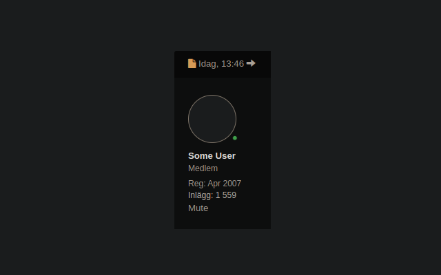
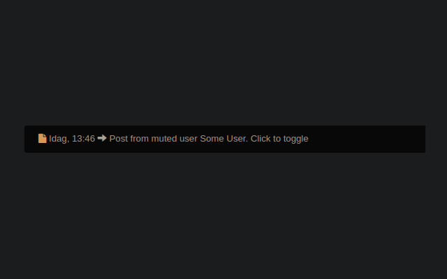

# Flashback Mute
This is an extension that allows users to mute posts by other users (or themselves)
on [flashback.org](https://flashback.org)

Mute, or ignore, was once a builtin feature of the site, but it was removed in 2015 (?).
This extension brings it back by allowing the users to quickly mute all posts by
specified users.

Once installed Mute links are added below each users' profile in their posts.

Clicking it will, by default, collapse all their posts.

Unmuting the user will reveal the posts again. In the future, when it's possible to show
a muted users list, it will be possible to optionally enable post deletion which will
cause their posts to disappear completely.

## Other Features
With this extension it is possible to temporarily collapse any post. This is intentional
as it can help hiding noise when trying to follow a thread within a thread. Reloading
the page will show the manually collaped posts again.

## Known Issues
- Replies to muted users still show the muted user's original post
- Data storage is not set in stone. Expect mute lists to disappear
- Muted posts are displayed for a short time before the script runs

## Future
- Post deletion option
- Import/export
- Data storage migration
- Reply handling
- Mute from user profiles
- Selective mute in certain topics or threads
